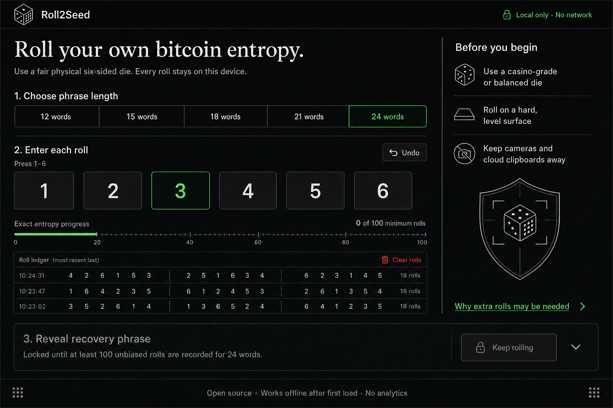
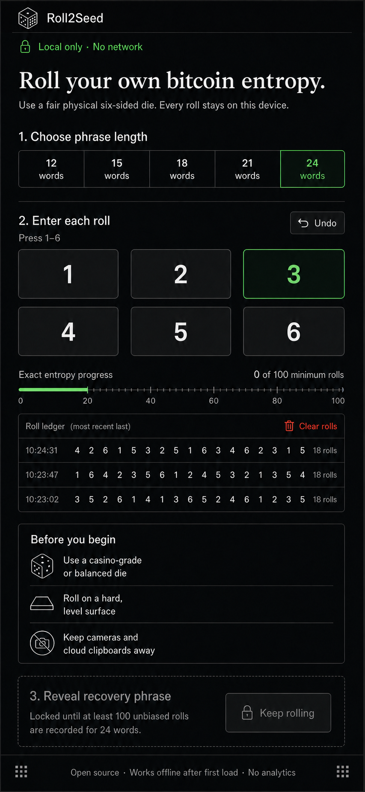

# Roll2Seed

**Turn physical dice rolls into Bitcoin-ready BIP39 seeds — offline, auditable, and yours.**

Local-first dice entropy tool for generating and verifying BIP39 mnemonics.

Roll2Seed turns rolls from one fair physical six-sided die into an exactly unbiased English BIP39 recovery phrase. The app runs entirely in the browser, keeps active state in memory only, and has no runtime network, storage, analytics, clipboard, QR, download, or print path.

It creates a BIP39 mnemonic. It does not create a wallet, derive keys or addresses, handle a BIP39 passphrase, or prove that the device and die are trustworthy.

Read [Entropy, dice, and Bitcoin recovery phrases](docs/entropy.md) before using the app with real funds. It explains what entropy protects, why the checksum is not additional randomness, how many rolls are required, and which failures this tool cannot prevent.

## Preview

### Desktop

[](design/roll2seed-concept-desktop.png)

### Mobile

<p align="center">
  <a href="design/roll2seed-concept-mobile.png">
    
  </a>
</p>

## Why entropy matters

A recovery phrase is a human-readable encoding of a wallet's secret starting material. If the source is predictable, biased, copied, observed, or reused, the resulting wallet can be guessed or reconstructed even when every later cryptographic step is correct. Hashing weak input does not create the missing uncertainty: an attacker can hash the same candidate inputs.

With an independent fair d6, each roll contributes `log2(6)`, about 2.585 bits, before conversion. BIP39 supports 128–256 bits of initial entropy; its checksum is derived from that entropy and does not increase its strength.

| Words | Entropy | BIP39 checksum | Minimum d6 rolls |
| ---: | ---: | ---: | ---: |
| 12 | 128 bits | 4 bits | 50 |
| 15 | 160 bits | 5 bits | 62 |
| 18 | 192 bits | 6 bits | 75 |
| 21 | 224 bits | 7 bits | 87 |
| 24 | 256 bits | 8 bits | 100 |

These are minimums. Because a power of six is not evenly divisible by a power of two, an unbiased conversion sometimes needs additional rolls. Roll2Seed recycles the rejected uniform tail and asks for another roll instead of introducing modulo bias.

## Run locally

Requires Node.js 22.12.0 or newer.

```sh
npm ci
npm run check
npm run serve
```

`npm run serve` serves the already-built `dist/` directory on `http://127.0.0.1:4173` with a restrictive Content Security Policy and other security headers. Run it locally on a trusted, secure machine. Set a different loopback port with `ROLL2SEED_PORT` if needed.

Production runtimes can provide `PORT`. The server still binds to loopback only;
hosting platforms set `PORT` automatically, so exposing a cleartext HTTP seed
generator to the network must never happen as a side effect. To deliberately
listen on all container interfaces, also set `ROLL2SEED_EXPOSE=1`—and only
behind a trusted TLS-terminating proxy. A cleartext HTTP deployment lets a
network attacker modify the delivered code and steal generated seeds; the
server prints a warning whenever it binds to a non-loopback interface.

`HOST` can select `localhost`, an IPv4 loopback address, or `::1` for local use.
Other `HOST` values are rejected unless `ROLL2SEED_EXPOSE=1` is also set; this
applies even when `HOST` is inherited from the environment. IPv6 loopback is
available at `http://[::1]:4173` with the default port.

For visual development only:

```sh
npm run dev
```

The Vite development server is bound to `127.0.0.1`, but the hardened production headers are applied by `npm run serve`, not the hot-reload server.

## Security model

The protected values are the ordered dice rolls, extracted entropy, and recovery phrase. Roll2Seed assumes:

- every value comes from an independent roll of a reasonably fair physical d6;
- the user records every result in order without rerolling patterns that look unusual;
- the local app files, browser, extensions, operating system, keyboard, display, and physical environment are trustworthy;
- the intended wallet supports the selected BIP39 word count.

Rejection sampling removes mathematical modulo bias. It cannot detect a biased die, chosen numbers, a mistyped roll, malicious software, a camera, or shoulder surfing. Keep a separate paper tally: the roll-review dialog lets you correct any identified transcription mistake, then discards and recomputes the derived phrase. The complete tally is equivalent secret material, so protect it like the phrase and destroy it once the recovery phrase is safely backed up. Never paste dice rolls or mnemonics into online tools. A small roll history also cannot prove that a die is fair, so the app intentionally provides no “randomness score.”

Refreshing, navigating away, or closing the tab destroys the active session. The app requests a native browser warning while rolls are present, but browsers do not guarantee that warning in every shutdown or mobile lifecycle case.

The app makes a best effort to drop references and overwrite mutable buffers when clearing. JavaScript cannot guarantee forensic erasure of strings, `BigInt` values, DOM internals, garbage-collected memory, swap, or crash dumps.

## Cryptographic process

For each physical face `1…6`, the sampler appends the base-6 digit `0…5` to a uniform `(value, range)` state. Once the range can cover `2^ENT`, only its largest evenly divisible prefix is accepted. A leftover tail remains uniform and is recycled with the next physical roll. This avoids unrestricted modulo reduction and does not discard the already-collected entropy.

The accepted value is serialized as exactly `ENT / 8` big-endian bytes. BIP39 appends the first `ENT / 32` bits of the SHA-256 digest, splits the result into 11-bit indexes, and maps those indexes through the locally embedded 2,048-word English list.

The vendored wordlist is from the Bitcoin BIPs repository and is checked at startup and in tests against SHA-256:

```text
2f5eed53a4727b4bf8880d8f3f199efc90e58503646d9ff8eff3a2ed3b24dbda
```

## Verification

```sh
npm test
npm run build
```

The tests cover official BIP39 boundary vectors, independent nontrivial 12- and 24-word dice vectors, exact rejection/acceptance boundaries, entropy recycling, leading zeroes, invalid dice faces, checksum validation, the embedded wordlist, and an exhaustive small uniformity proof.

Before using a phrase for funds, test a complete restore in the intended wallet. A six-position paper spot-check is useful transcription feedback, not a substitute for a real recovery test.

Security-sensitive defects should be reported privately as described in [SECURITY.md](SECURITY.md). Never include a real mnemonic, dice-roll sequence, private key, address balance, or other live wallet data in a report.

## Standards and sources

- [BIP39 specification](https://github.com/bitcoin/bips/blob/master/bip-0039.mediawiki)
- [Official BIP39 English wordlist](https://github.com/bitcoin/bips/blob/master/bip-0039/english.txt)
- [NIST SP 800-90B: Entropy Sources](https://csrc.nist.gov/pubs/sp/800/90/b/final)
- [NIST IR 8427: Full Entropy Assumption](https://csrc.nist.gov/pubs/ir/8427/final)
- [Web Cryptography API](https://www.w3.org/TR/webcrypto/)
